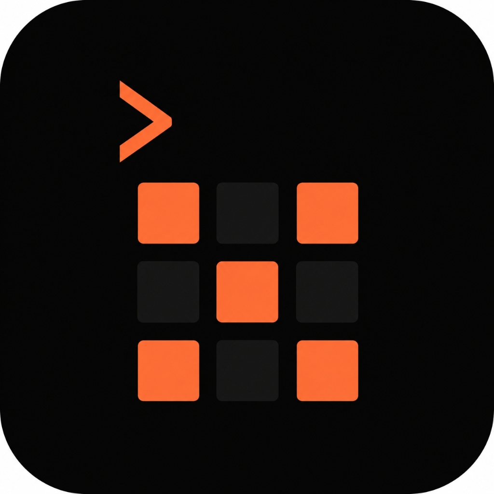

<div align="center">



# GrindOS
### Built for the Grind.

A desktop app for tracking your LeetCode journey — problems, streaks, code, and everything in between. No cloud. No login. Just you and the grind.

[](https://github.com/Kaustubhhbhoirr/GRINDOS/releases)


</div>

---

## What is GrindOS?

Most people track their LeetCode progress in a messy Notion doc, a spreadsheet, or not at all. GrindOS fixes that.

It's a native Windows desktop app — think VS Code or Discord, not a website — where you log every problem you solve, write your approach, store your actual code, and watch your progress build up on a GitHub-style activity calendar. Your data lives as a local JSON file on your machine. Nothing goes to any server, ever.

Made by **Kaustubh Bhoir**, FY CS student — because I needed this tool and it didn't exist.

---

## Features

| | |
|---|---|
| 📅 **Activity Calendar** | GitHub-style calendar showing your daily grind. Click any day to see what you solved. Orange squares = solved, yellow = revisited, half-orange = attempted. |
| 📝 **Problem Logger** | Log problems with title, difficulty, tags, approach notes, full solution code (Monaco editor with syntax highlighting), time spent, self rating, and sources. |
| 🔄 **Revisit Queue** | Flag tough problems for later. Get a nudge on startup to go back and re-solve them. |
| ⏳ **Incomplete Tracker** | Marked a problem as partial? It lives in the Incomplete tab until you finish it. |
| 📊 **Profile & Stats** | Total solved, best streak, average solve time per difficulty, strongest and weakest topics, full year heatmap, and milestone badges. |
| 🔍 **Search** | Search your entire problem library by name, number, tag, difficulty, or rating. |
| 🔔 **Smart Notifications** | Personalized greeting on startup + toast nudges for revisit and incomplete problems. |
| 💾 **Export / Import** | Back up your data as JSON anytime. Restore it on a new machine in one click. |

---

## Screenshots

> Coming soon — demo GIF in progress.

---

## Download

👉 **[Download GrindOS-Setup.exe](https://github.com/Kaustubhhbhoirr/GRINDOS/releases)**

> **⚠️ Windows SmartScreen Warning:** Windows may show a security warning when running the installer. This is normal for unsigned open source apps. Click **"More info"** → **"Run anyway"** to proceed. Your machine is safe.

Double-click and install. No Node.js, no setup, no account needed.

---

## Tech Stack

- **Electron** — desktop runtime
- **React + Vite** — UI
- **Tailwind CSS** — styling
- **Monaco Editor** — code editor (same as VS Code)
- **Local JSON** — all data stored on your machine in `AppData`

---

## Run Locally

```bash
git clone https://github.com/Kaustubhhbhoirr/GRINDOS.git
cd GRINDOS
npm install
npm run dev
```

## Build .exe

```bash
npm run dist
```

Installer saved to `release/GrindOS-Setup.exe`

---

## Data & Privacy

Everything stays on your machine. GrindOS is 100% offline — no accounts, no telemetry, no cloud. Your `problems.json` lives in your local AppData folder. Use Export to back it up before switching machines.

---

<div align="center">

## About the Developer

Made by **Kaustubh Bhoir** <br />
[](https://www.linkedin.com/in/kaustubh-bhoir-ce/)
[](https://github.com/Kaustubhhbhoirr)

---

<sub>GrindOS • Built with 🔥 for the grind</sub>

</div>
